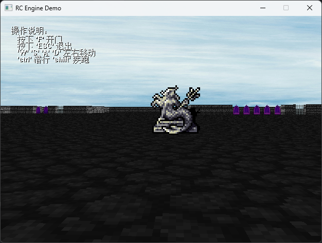

<h1> RCEngine</h1>

RCEngine 是一个基于 EasyX 的伪 3D 游戏引擎，旨在为用户提供一个简单、易于学习的游戏开发环境。使用 RCEngine，你可以快速创建一个你的伪 3D 游戏。

## 简介

RCEngine 是一个基于 EasyX 的伪 3D 游戏引擎，旨在为用户提供一个简单、易于学习的游戏开发环境。它提供了一些基本的 3D 功能，如场景、相机、材质等，以及一些基本的游戏功能，如角色控制、碰撞检测等。用户可以通过学习 RCEngine 的基本概念和 API，快速地创建自己的伪 3D 游戏。

## 安装

首先，确保已经安装了 EasyX 图形库。然后，从 GitHub 上下载 RCEngine 的源代码，并将其解压缩到本地目录。你可以使用 CMake 编译（依靠 CMakeLists.txt）出 *RCEngine.lib* 供你的项目使用，或直接将源码复制到你的项目中直接引用。

注意需要特别设置好 RCEngine 的头文件目录，否则编译将会报错。

## 使用说明

在开始使用 RCEngine 之前，请确保已经阅读了 RCEngine 的官方文档，了解其基本概念和 API。具体的文档请参见 document 目录下的 *index.html*。

## 范例

RCEngine 项目处于起步阶段，目前只有项目目录下的 *main.cpp* 可供参考。

## 范例截图

## 项目地址与技术支持

你可以在 [GitHub 上](https://github.com/FSMargoo/RCEngine) 获取本项目的源码，并可以在 GitHub 的 issues 栏目或通过我的邮箱（margoo@margoo.icu）同我取得联系。